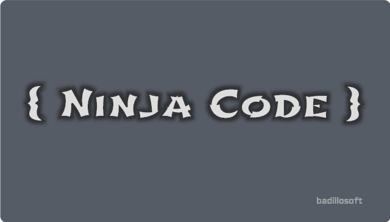

# Ninja Code Project

Alan Badillo Salas (badillo.soft@hotmail.com)

Donaciones: https://paypal.me/badillosoft

## Introducción

`Ninja Code Project` consiste en una serie de tutoriales gratuitos disponibles en *YouTube* y accesibles para cualquier hispanohablante para aprender a programar en `HTML`, `CSS`, `Javascript`, `Angular`, `Ionic`, `React`, `Vue` y un sin fin de tecnologías web y móviles. Este proyecto vive gracias a tus donaciones y espera llegar a ser referencia para los nuevos programadores del futuro que buscan construir un mundo mejor a través del código.
